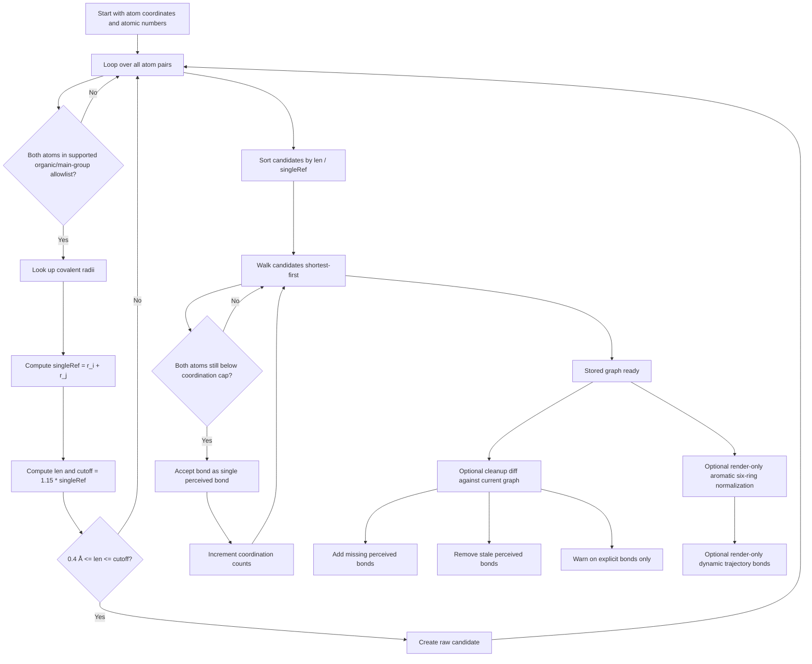

# Bond Inference

VibeMol now uses a conservative **connectivity-first** bond perception model.

The implementation lives in `assets/app/js/bond-inference.js`. The important design choice is:

- geometry can create an initial bond graph on import
- user-authored bonds and bond orders are preserved explicitly
- moving atoms in edit mode does **not** auto-create or auto-delete bonds
- aromatic six-ring normalization is a **render-only** display pass

## Overview

There are four distinct behaviors:

1. infer an initial single-bond connectivity graph from geometry
2. store inferred bonds with provenance `origin: 'perceived'`
3. let the user override/create/delete bonds, which become `origin: 'explicit'`
4. optionally show benzene-like alternating ring display without changing stored topology

In trajectory playback, VibeMol uses a transient geometry-based bond graph for rendering only. The stored graph is not mutated frame-to-frame.

## 1. Inferring Bonded Pairs

This is implemented by:

- `collectRawBondCandidates(...)`
- `acceptBondCandidatesByDistanceRank(...)`
- `perceiveBondConnectivity(...)`

### Supported elements

Automatic bonding is intentionally limited to an organic/main-group allowlist:

- `H`
- `B`
- `C`
- `N`
- `O`
- `F`
- `Si`
- `P`
- `S`
- `Cl`
- `Br`
- `I`

Unsupported elements are skipped entirely during automatic perception. That includes:

- transition metals
- lanthanides/actinides
- alkali and alkaline-earth metals
- any element not in the allowlist

### Raw distance test

For each atom pair `(i, j)`:

- look up covalent radii:
  - `r_i = covalent_radius(Z_i)`
  - `r_j = covalent_radius(Z_j)`
- define the nominal single-bond reference length:
  - `singleRef = r_i + r_j`
- define the acceptance cutoff:
  - `cutoff = 1.15 * singleRef`
- compute the actual distance:
  - `len = |R_i - R_j|`

The pair becomes a **raw candidate** only if:

```text
0.4 Å <= len <= 1.15 * (r_i + r_j)
```

This is only the first filter. VibeMol does **not** accept every passing pair as a bond.

## 2. Distance-Ranked Greedy Acceptance

Raw candidates are then sorted by increasing:

```text
len / (r_i + r_j)
```

So the shortest bond relative to the element-pair reference is accepted first.

Each supported element also has a maximum coordination cap:

- `H: 1`
- `B: 4`
- `C: 4`
- `N: 4`
- `O: 2`
- `F: 1`
- `Si: 4`
- `P: 5`
- `S: 6`
- `Cl: 1`
- `Br: 1`
- `I: 1`

Candidates are accepted greedily in ranked order only if **both** endpoint atoms are still below their cap.

Every automatically perceived bond is stored as:

- `order = 1`
- `kind = 'normal'`
- `origin = 'perceived'`

There is no automatic persistent promotion to double/triple/quadruple order anymore.

## 3. Bond Provenance

Stored bonds may carry:

- `origin: 'perceived'`
- `origin: 'explicit'`

Rules:

- geometry-based import inference creates `perceived` bonds
- `vibemol.structure` import preserves stored origin
- missing origin on older structure files defaults to `explicit`
- bond-tool create/update operations produce `explicit` bonds
- changing the order of a perceived bond upgrades it to `explicit`
- molecule/template bonds are `explicit`

This lets cleanup and undo/redo preserve user intent.

## 4. Clean Up Bonds

The Bond tool includes a reviewed **Clean Up Bonds** workflow.

It recomputes the geometry-based perceived graph from the current coordinates and classifies the difference against the stored graph.

### Diff classes

- `additions`
  - newly perceived bonds that are missing from the current graph
- `removable`
  - stored bonds with `origin: 'perceived'` that are no longer supported by geometry
- `warnings`
  - stored bonds with `origin: 'explicit'` that the current geometry would not auto-perceive

Important rule:

- explicit bonds are **never** auto-removed by cleanup

Apply behavior:

- add missing bonds as `origin: 'perceived'`
- remove only `origin: 'perceived'` bonds in the removable set
- leave explicit bonds untouched

## 5. Aromatic Six-Ring Display

`inferAromaticSixRings(...)` still detects benzene-like planar carbon six-rings and normalizes a **copy** of the render-edge list to alternating single/double order for display.

This affects:

- multi-bond rendering
- dashed aromatic inner-ring overlays

This does **not** overwrite the stored `vol.bonds`.

## 6. Trajectory Rendering

When a record has multi-frame XYZ trajectory data and the app is **not** in edit mode:

- bond rendering uses a transient connectivity graph recomputed from the displayed frame

This is render-only behavior:

- stored `vol.bonds` remain unchanged
- `Save Structure` exports the stored graph
- plain XYZ export remains coordinates-only

## Pseudocode

```text
function perceive_connectivity(atom_positions):
    raw_candidates = []

    for each pair (i, j), i < j:
        if element_i is unsupported or element_j is unsupported:
            continue

        r_i = covalent_radius(Z_i)
        r_j = covalent_radius(Z_j)
        single_ref = r_i + r_j
        cutoff = 1.15 * single_ref
        len = distance(atom_i, atom_j)

        if len < 0.4 or len > cutoff:
            continue

        raw_candidates.append({
            i: i,
            j: j,
            len: len,
            ratio: len / single_ref
        })

    sort raw_candidates by:
        1. ascending ratio
        2. ascending len
        3. ascending i
        4. ascending j

    accepted = []
    coordination = zeros(atom_count)

    for candidate in raw_candidates:
        max_i = element_max_coordination(atom_i.Z)
        max_j = element_max_coordination(atom_j.Z)

        if max_i <= 0 or max_j <= 0:
            continue
        if coordination[i] >= max_i:
            continue
        if coordination[j] >= max_j:
            continue

        coordination[i] += 1
        coordination[j] += 1
        accepted.append({
            i: i,
            j: j,
            order: 1,
            maxOrder: 1
        })

    return accepted
```

Cleanup classification:

```text
function classify_cleanup(current_graph, atom_positions):
    perceived = perceive_connectivity(atom_positions)

    additions = perceived - current_graph
    removable = {
        bond in current_graph
        where bond.origin == 'perceived'
        and bond not in perceived
    }
    warnings = {
        bond in current_graph
        where bond.origin == 'explicit'
        and bond not in perceived
    }

    return { perceived, additions, removable, warnings }
```

## Flowchart


