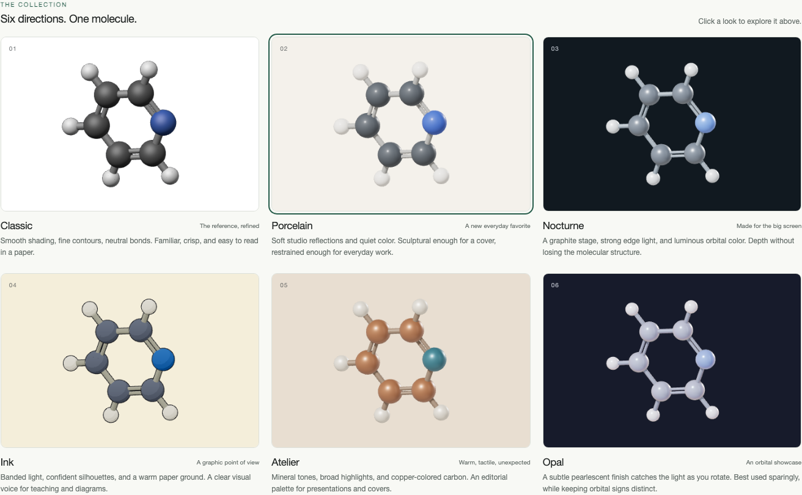
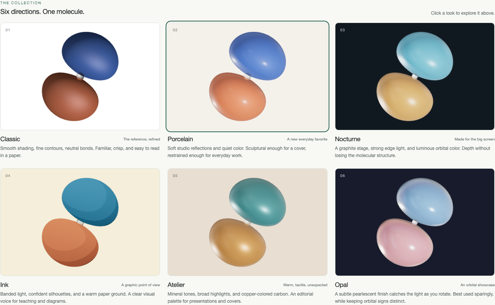

# Visual Style Lab

The native editor now includes Basic, Toon, Kit, Classic, Porcelain, Ink, and Opal in its preset menu. Material controls are shared across atoms, bonds, and surfaces. Studio recipes include the Lab's light directions, intensities, reflections, and tone mapping. See [the current appearance guide](../../appearance-looks.md) for the implemented behavior; the study and original design notes below remain a reference.

Start with the [native renderer comparison](compare.html) and the [component editor documentation](../../appearance-looks.md). The product presets are **Basic, Toon, Kit, Classic, Porcelain, Ink, and Opal**. Nocturne and Atelier remain candidates. The comparison loads actual VibeMol instances, supports complete looks or materials-only comparisons, and opens the same native editor used in the app. Its previews do not overwrite ordinary appearance autosave or workspace recovery.

The original `/docs/experiments/style-lab/` page is retained as an isolated historical study. Its separate renderer, UI skin, and `vibemol.look-study` files are not the product architecture. The notes below describe that earlier experiment; the native component editor supersedes the proposed gallery/Polish integration. Native material editing uses one shared material for atoms, bonds, and surfaces, with physical material parameters, Toon bands, lighting, and reusable material swatches.

## Orbital reference presets

[Compare the three native VibeMol renders and download the presets](orbital-reference.html).

The second supplied reference shows opaque blue/orange lobes, smooth shading, small bright highlights, and a white background. **Emissive** is the closest existing option for its vivid, nearly uniform color and compact highlight. **Enamel** adds stronger depth shading with restrained clearcoat, a little colored fill, and no studio-environment reflections. **Satin** is a softer alternative. Lacquer's strong room reflections and Ceramic's broad reflective patches are less similar to this reference.

| Native preset | Roughness | Clearcoat | Coat roughness | Emissive fill | Environment |
| --- | ---: | ---: | ---: | ---: | ---: |
| [Emissive](presets/orbital-emissive.preset.json) | 1 | 1 | 0.1 | 0.8 | 0 |
| [Enamel](presets/orbital-enamel.preset.json) | 0.28 | 0.45 | 0.12 | 0.12 | 0 |
| [Satin](presets/orbital-satin.preset.json) | 0.45 | 0 | 0.1 | 0 | 0.8 |

All three use zero metalness, zero transmission, 100% opacity, positive orange `#ff8000`, negative blue `#0066b3`, and a white background. They choose Basic molecule shading (Toon forces toon surfaces), turn off fog/ink/depth of field, and preserve coordinates, camera, orbital visibility, phase mapping, isovalue, and Auto-iso. The colors approximate the supplied raster; its phase signs, orbital identity, and isovalue are unknown.

Load an orbital in the main app, select its layer, then drag in a preset JSON file. These files use the existing **`vibemol.preset`** format; they are not imported through the six-look lab's **Import look** button. Native preset import updates the active cube layer and appearance defaults; it does not restyle every existing orbital. To edit a group together, select its **Orbitals** header and set the same material, opacity, and colors through Appearance → Surfaces.

Enamel requires this branch. An older app that does not recognize it falls back to its default material. Emissive and Satin are already available, although older preset import code can reset the material/opacity while applying a color scheme. This branch fixes that redraw ordering and an obsolete depth-of-field disposer that interrupted strict imports.

Use **Download preset** after customizing for reuse with another orbital, and **Save session** to preserve the exact scene and per-layer appearance. The previews are native VibeMol canvas exports of the analytic hydrogen `2p_z` function below, sampled on a 41³ grid at 0.4 bohr spacing and contoured at ±0.018. They use identical geometry and camera. No user reference image is copied into the repository.

## Recommendation

Add a **Looks** library at the top of Appearance: thumbnail → adjust → **Save as new**. A look is a named, complete set of rendering choices: geometry proportions, atom and bond material, lighting, palette, background, and orbital surface treatment. Keep **Classic**, **Porcelain**, and **Nocturne** as the first product candidates. Use **Ink**, **Atelier**, and **Opal** to explore a broader visual range.

The supplied reference combines broad highlights, smooth sphere shading, fine dark contours, relatively large atoms, neutral cylindrical bonds, an orthographic view, and a white background. These are independent decisions; users should be able to adjust them without losing the overall recipe.

| Look | Visual direction | Best use |
| --- | --- | --- |
| Classic | Broad Phong highlights, thin contours, neutral bonds, white ground | Familiar figures and the supplied reference |
| Porcelain | Soft physical materials, restrained studio reflections, gentle shadows | Proposed everyday default; figures and slides |
| Nocturne | Graphite background, strong edge light, restrained metallic response | Talks and dark presentation layouts |
| Ink | Banded shading, clear silhouettes, warm paper | Teaching and diagrammatic communication |
| Atelier | Copper-colored carbon, mineral palette, broad reflections | Editorial figures; explicitly a custom element palette |
| Opal | Subtle thin-film iridescence, cool pearls, contrasting signed surfaces | Optional orbital showcase; avoid where hue carries quantitative meaning |

The material and lighting differences are rendered in WebGL. There is no image-generation step or offline render substituted for the interactive preview. All six thumbnails use the same subject, coordinates, camera, and orbital isovalue. Camera rotation remains unchanged when switching looks in the main preview.





## What works in the study

- Six looks with live atom size, bond thickness, polish, outline, key/edge lighting, advanced material controls, element and orbital colors.
- Three subjects: ideal tetrahedral methane (C–H = 1.09 Å), the repository's pyridine fragment, and an analytic hydrogen 2p orbital. Pyridine's alternating double bonds are explicit. Changing the look never changes coordinates or connectivity.
- The orbital is the normalized hydrogen wavefunction `ψ = z exp(-r/2) / (4 sqrt(2π))`, with coordinates in bohr, sampled on a 49³ grid spanning −8…8 bohr and contoured at ±0.018 a₀⁻³/². It is labelled as an analytic example, not a computed MO of either preview molecule. Surfaces use VibeMol's existing marching-cubes and gradient-normal helpers. The sign legend stays visible.
- Built-ins are immutable. Editing shows **Modified**; **Revert** restores the source look. **Save as new** creates a named copy; **Update saved** changes an existing user look, including its name.
- The current draft and up to 50 named copies survive reloads in a separate browser-storage namespace. Export/import restores all appearance values using an explicitly versioned, validated study format. Files are capped at 64 KB. Storage failures report an export fallback.
- PNG downloads capture the rendered canvas at the current preview size. Pointer orbit/zoom, keyboard-accessible rotation buttons, responsive layout, and rendering only when the view changes.

Look files from this study currently reopen **in this lab only**. This is an experiment format, not a second proposed production format. Samples, browser draft storage, and defaults in the main app are not changed by using it.

## Product workflow and preservation

1. **Choose a look.** Show visual thumbnails above Quick style, with Built-in and My looks sections. A small number of polished recipes should be enough; avoid making every combination a new rendering mode.
2. **Adjust a few meaningful controls.** Start with atom size, bond thickness, polish, contour strength, lighting, and palette. Put technical material parameters in Advanced. Disable controls that do not affect the chosen material or current content.
3. **Keep the original.** Built-ins are read-only. Show `Porcelain · Modified` until Save as new or Revert. Update is available only for a saved user look. Named saving and browser autosave are separate actions.
4. **Choose what carries over.** Applying a look changes appearance only. Preserve camera position, atom coordinates, selections, playback, visibility choices, isovalues/Auto-iso, and orbital phase mapping. For multiple orbital layers, offer a clear scope such as focused group or all orbital groups, using the existing group-target resolver.
5. **Preserve exact values.** Store the resolved settings, recipe ID, and recipe revision. A session contains its complete resolved look; it must reopen correctly on another machine without the user's local look library. Updating a built-in recipe must not silently restyle an older session.
6. **Reuse and share.** Add Set as default for new sessions, portable preset export/import, duplicate, rename, and delete to My looks. A user's saved default applies at new-session creation; explicit session restore takes precedence. Embed the environment/lighting rig identity and version so the same look can be reconstructed.

“Same look” should mean the same saved material, palette, geometry proportions, and lighting parameters. Bit-identical images across GPUs are a separate export-quality problem and are not promised by preset persistence.

## Fit with the current code

The main app already has the necessary foundation:

- `assets/app/js/preset.js` has scoped setting registration, validation hooks, import/export, and portable named envelopes.
- `app.js` uses `registerAppearancePresetSetting` and the `appearanceAutosave` persistence scope for current appearance autosave. It already saves radii, style, element overrides, shadows, surface materials, and other appearance controls.
- `session.js` captures complete workspace state, including preset and per-layer appearance. Store the resolved look through those existing paths rather than a dependency on the user's browser library.
- `getSurfaceAppearanceTargets()` resolves sidebar orbital/group edits. Full looks update global surface defaults while preserving explicit per-layer color/opacity overrides, `iso`, `isoPending`, `autoIsoEnabled`, visibility, and recipes. Studio Surfaces exposes the defaults and an explicit action to reset overrides.
- `buildAtomMaterialForCurrentStyle`, `getBondMaterial`, and style lighting in `app.js` currently encode many fixed rendering parameters. `applyStructureMaterialEnvBaseline` explicitly sets atom/bond `envMapIntensity` to zero, even though a studio environment map is already loaded. Controlled environment response is a practical improvement available with the current renderer.

For production, extract a small `appearance-look.js` controller and renderer material/lighting factories. Register every new durable setting in the existing preset registry. Reuse the `vibemol.preset` envelope for looks with an explicit look scope; do **not** blindly reuse the whole current appearance-autosave scope, which also contains isovalues, visibility, and other choices that a purely visual look should preserve. Keep new look ID/revision metadata separate from resolved setting values. Apply settings as one transaction and rebuild once.

The study's rendering code is deliberately isolated in this directory. Do not copy its second scene into production. Move approved recipes into the app's shared renderer so editing previews, trajectories, orbital grids, PNG exports, CLI renders, and saved sessions all receive the same material policy. Retain Basic/Toon/Kit compatibility; named looks are an additional layer over rendering choices.

## Delivery order

1. Agree on Classic, Porcelain, and Nocturne using methane, a larger heteroatom-rich molecule, and actual Molden/cube files. Tune neutral backgrounds and highlights at publication size.
2. Expose material polish, contour strength, atom/bond environment response, and key/fill/edge light through shared material factories. Improve contours to maintain a stable screen-space width, including in high-resolution PNG export.
3. Add the Looks library and exact preset/session round-trips. Regress applying looks without disturbing geometry, isovalues, layer scope, or camera; verify browser restart, fresh-machine imports, CLI output, and changing built-in versions.
4. Evaluate optional high-quality ambient occlusion and export supersampling against measured frame time. Keep anti-aliasing, surface normals, contact shadows, and color management ahead of blur or glow. Existing weighted transparency should remain the production path for orbital overlays.
5. Offer Ink and Atelier as alternatives. Treat Opal as an opt-in presentation treatment; keep ordinary element/sign colors available and clearly labelled.

## Limits and validation

This prototype uses ordinary Three.js transparency, not the app's weighted blended transparency. It has no refraction, ambient-occlusion post-pass, depth of field, or path tracing. It has not been performance-qualified for large molecules. Outlines are simple geometric shells and can show join artifacts; production contours need screen-space treatment. The existing studio PNG is reused locally, without adding remote dependencies.

Run:

```sh
node --check docs/experiments/style-lab/looks.js
node --check docs/experiments/style-lab/style-lab.js
node --test tests/unit/style-lab-looks.test.mjs
python tests/e2e/style_lab.py
```

The browser test checks the collection, all subjects, geometry/camera preservation, saved/modified/reverted appearance, reload persistence, exact exported/imported values, invalid-file rejection, PNG output, and narrow layouts. It is an explicit experiment check. `tests/e2e/premerge.py` also checks all three native orbital presets, preservation of geometry/camera/isovalues, session restoration, named/custom palette import, and transparent rendering after disabling depth of field. The production smoke suite includes the Enamel material option.
